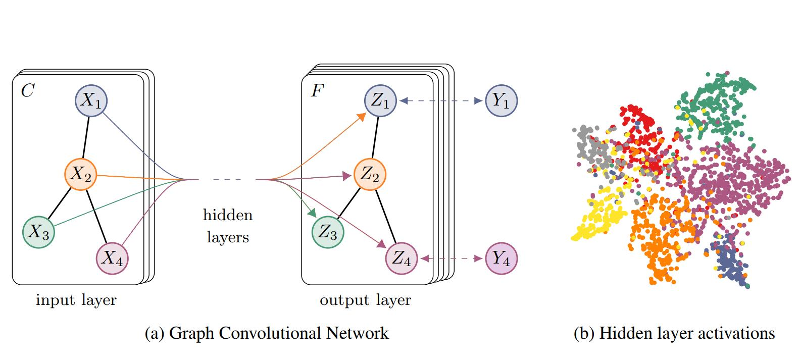

# SEMI-SUPERVISED CLASSFICATION WITH GRAPH CONVOLUTIONAL NETWORKS

Author: Thmos N.Kipf
Link: https://arxiv.org/pdf/1609.02907.pdf
Publisher: ICLR
Publishing/Release Date: Feb 22, 2017
Score /5: ⭐️⭐️⭐️⭐️⭐️
status: No

# overview

这篇文章是GCN领域的经典论文，使用频谱卷积作用在图上，完成半监督学习任务。问题的提出，假设我们需要完成对一个图上的所以节点进行分类。但是我们只有这个图上的少量节点的信息。

# introduction

文章以这样一个问题开始，假设我们需要对一个引文网络中的文档进行分类这就是一个图问题，我们有一个图，我们需要对图中的节点进行分类，但是我们只有图中一小部分节点的标签。这个问题就是一个基于图的半监督学习问题。

  

这里  代表监督学习部分的loss，即这个图中有标签的节点产生的loss。 )   一般是一个小的神经网络或者可微函数。   是一个常量，   是一个包含所有节点特征向量的矩阵。   表示这个图的拉普拉斯矩阵这，这个图是一个无向图 )  ，它有  个节点，  个边，  且 %20\in%20\mathcal{E}) ，还有一个邻接矩阵  和一个度矩阵  。在上述等式的建模方式中，我们假设图中的节点，如果他们相连，那么他们更有可能拥有相同的标签。

针对这个问题，我们首先使用一个神经网络模型 )  对所有带标签的节点进行训练，获得监督学习部分的loss   , 再使用 ) 对图的邻接矩阵进行处理，这将允许模型从监督损失L0中分配梯度信息，并使其能够学习带标签和不带标签的节点表示。

这篇文章的工作主要有两点，1. 文中针对上述的神经网络模型提出了一个简单，并且表现良好的分层传播机制。并解释了如何从谱图卷积中激发这个想法。2. 文中演示了这种基于图的神经网络模型如何用于快速和可扩展的图中节点的半监督分类。并且在大量数据集上的实验表明，文中提出的模型在分类精度和效率等方面都优于先进的半监督学习方法。

## FAST APPROXIMATE CONVOLUTIONS GRAPHS

文中提出了一个基于如下传播规则的GCN：

  

其中，   是一个无向图  的邻接矩阵和一个自连接矩阵的和。   是一个单位矩阵，   ，   是其中一层的权重矩阵。 )  是一个激活函数，   是网络的第  层参数矩阵，  。

## SEMI-SUPERVISED NODE CLASSIFICATION

这里我们先跳过文章的证明，回到这个半监督的节点分类问题。文中最终使用两层的GCN网络，在预处理部分，先完成   的运算，整个模型的传播过程就是下面这个简单形式：

  

- (a) 是模型的示意图，输入  经过一个GCN网络，转换成feature_map   ，最后生成标签  ，其中黑色的边，在每一层都共享。
- (b) 是1个两层的GCN模型在使用5%的标签的Cora数据集上训练的可视化效果，不同颜色代表不同分类

这里  是输入层到隐藏层的权重矩阵。  是隐藏层到输出层的权重矩阵，激活函数使用softmax。最后使用所有标签样本的交叉熵loss作为这个半监督学习任务的loss。

  

  是有标签节点的集合，作者训练这个模型时是使用全局梯度下降，使用完整的数据集对每次训练迭代执行批量梯度下降。对  使用稀疏表示，则内存需求为 ) ，需要内存跟边的数量是线性的，如果内存不够，还是建议使用小批量随机梯度下降。